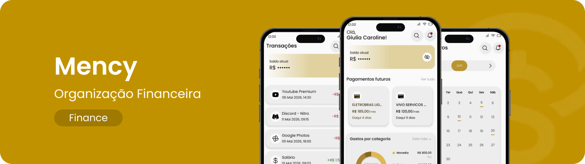

  

 

O Mency nasceu com o propósito de tornar o controle financeiro pessoal mais simples, organizado e inteligente. Através de uma interface intuitiva e da integração com Open Finance, o aplicativo permite acompanhar suas finanças, visualizar gastos e consultar transações bancárias em um só lugar.

Desenvolvido como um aplicativo multiplataforma, o Mency combina React Native, Node.js e PostgreSQL para oferecer uma experiência prática e segura para o gerenciamento do dia a dia financeiro.

##  O que você encontra por aqui?

O Mency foi pensado para facilitar o acompanhamento das suas finanças e reduzir a necessidade de registros manuais. Confira algumas das principais funcionalidades:

  
  <b>Cadastro e Autenticação</b> 
  Crie sua conta, faça login com segurança e tenha suas informações protegidas por autenticação JWT.

 

  
  <b>Dashboard Financeiro</b> 
  Acompanhe seu saldo, receitas, despesas e a distribuição dos seus gastos de forma visual e organizada.

 

  
  <b>Conexão Bancária</b> 
  Conecte sua conta bancária através do Pluggy Connect e consulte suas informações financeiras diretamente pelo aplicativo.

 

  
  <b>Automação de Despesas</b> 
  Consulte suas transações bancárias automaticamente através da integração com a API da Pluggy, sem precisar cadastrar cada gasto manualmente.

 

  
  <b>Registro de Transações</b> 
  Registre manualmente receitas e despesas informando valor, categoria, data e descrição.

 

  
  <b>Relatórios Financeiros</b> 
  Visualize seus gastos organizados por categoria e período para entender melhor seus hábitos financeiros.

##  Nossa ideia

O Mency foi desenvolvido para ajudar jovens adultos, estudantes e profissionais autônomos a terem mais controle sobre suas finanças.

A proposta é transformar informações financeiras em uma experiência simples e visual, permitindo acompanhar receitas, despesas e saldo sem depender de planilhas ou registros complexos.

Além disso, a integração com Open Finance permite consultar informações bancárias de maneira prática, enquanto o aplicativo mantém os dados financeiros em memória durante a sessão, sem armazenar as transações no banco de dados do Mency.

##  Segurança

Por trabalhar com informações financeiras, o Mency possui mecanismos voltados à proteção dos dados e das credenciais dos usuários.

Entre as medidas adotadas estão:

* Autenticação utilizando JWT;
* Senhas armazenadas utilizando hash bcrypt;
* Comunicação entre aplicativo e API através de HTTPS/TLS;
* Credenciais e chaves de API armazenadas em variáveis de ambiente;
* Validação e sanitização dos dados recebidos pela API;
* Restrição de origens através de CORS;
* Não armazenamento das transações financeiras consultadas através da Pluggy;
* Nenhum armazenamento de credenciais bancárias do usuário.

 

  

 

  

